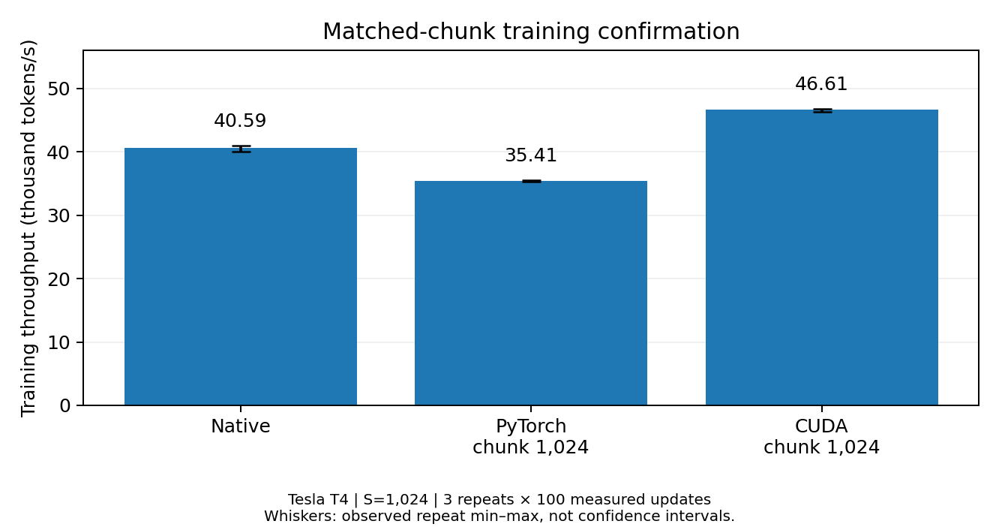

**CUDA cross-entropy and chunk-size trade-offs for transformer training on a Tesla T4.**

**Author:** Irtiqa Haider · [Compiled report](report/BudgetCE_Report.pdf) · [Colab notebook](notebooks/BudgetCE.ipynb) · [Raw evidence](data/)


BudgetCE implements a memory-bounded linear cross-entropy forward/backward path using CUDA row-reduction kernels and a recomputing PyTorch autograd function. Matrix multiplication uses PyTorch's backend; this is not a custom GEMM library. The repository includes the actual measurements, numerical checks, and an offline audit—not simulated performance results.

## Main result: longer, matched-chunk training

A targeted confirmation used a 20.19M-parameter decoder, sequence length 1,024, effective batch two, and three repeats of **20 warmup + 100 measured optimizer updates** per method. Both chunked implementations used chunk size 1,024.

| Implementation | Training tokens/s | Mean step time | Peak allocated memory |
|---|---:|---:|---:|
| Native PyTorch | 40,593 | 50.45 ms | 841.33 MiB |
| PyTorch chunk 1,024 | 35,411 | 57.84 ms | 809.84 MiB |
| CUDA chunk 1,024 | **46,607** | **43.94 ms** | **569.84 MiB** |

Compared with native, the CUDA path delivered **14.8% higher throughput** and **32.3% lower peak PyTorch allocated memory**. Compared with this project's matched-chunk PyTorch implementation, throughput was **31.6% higher**. CUDA was faster in all three matched repeats. These are within-session observations, not confidence intervals or a claim about the best third-party implementation.



Source: [recomputed training table](results/matched_training.csv), [repeat-paired comparisons](results/matched_comparisons.csv), and [validation](results/validation.json).

## Other findings

- Across six held-out operator shapes, CUDA chunk 1,024 achieved **1.17–1.34× native forward/backward throughput**. At N=4,096, V=65,536, D=512, extra peak operator allocation fell **87.5%**, from 3,140 to 392 MiB. This is **not** the whole-training memory reduction.
- At matched chunk size 256, CUDA was **1.55–1.69× faster** than the project's recomputing PyTorch operator.
- All 12 selector decisions met their measured workspace allowance, but **the learned selector made the same choices as the largest-predicted-feasible-chunk rule**. No learned-policy advantage is claimed.

The nine-trial confirmation was chosen after inspecting the first study. Its results are analyzed separately, not pooled with the original shorter windows.

## Reproduce the tables without a GPU

Python 3.10+ is sufficient for the arithmetic audit. Install NumPy for the optional planner-rank diagnostic and Matplotlib for figures:

```bash
python -m pip install numpy matplotlib
python scripts/verify_release.py
python scripts/reproduce.py --out reanalysis
python scripts/plot_results.py --results reanalysis
```

The audit checks source identity, hashes, coverage, optimizer counts, numerical tolerances, memory formulas, and summary arithmetic. It does **not** execute archived code or independently reproduce CUDA numerics. The source directory is compared with the source recorded in the experiments.

## Run new GPU experiments

Use the notebook or follow [REPRODUCE.md](REPRODUCE.md). The notebook defaults to auditing the included data; GPU execution requires explicitly setting `RUN_NEW_EXPERIMENT = True`. It runs the correctness gate first and preserves failure checkpoints.

A CUDA-enabled PyTorch installation and `nvcc` are required. The recorded environment was **PyTorch 2.11.0+cu128 / CUDA toolkit 12.8 / Tesla T4**. Dependencies in `requirements-colab.txt` deliberately do not replace Colab's installed PyTorch. New hardware or software results are separate experiments, not assumed bitwise reproductions.

```bash
python -m pip install -r requirements.txt
python -m pytest -q
```

## Files

```text
budgetce/        Exact measured Python/CUDA implementation
scripts/         Offline audit, figure generation, and matched-trial runner
configs/         Original screening and confirmation configurations
notebooks/       One repository-backed Colab notebook
tests/          CPU regression and release-audit tests
data/           Two compact evidence archives and input provenance
results/        Recomputed CSVs, validation records, and three figures
report/         Compiled report only, credited to Irtiqa Haider
```

## Interpretation and limits

One T4, synthetic inputs, one decoder architecture, fixed math attention, and three repeats per condition. Measurements include forward/backward and complete optimizer work where indicated. Allocated memory is not reserved or whole-device memory. GPU clocks and process isolation were not recorded; no kernel-counter or profiler claims are made. Loss trajectories are not bit-identical, and convergence or output quality was not evaluated. All tested workloads physically fit on the device. No distributed-scaling, maximum-batch, or state-of-the-art library claim is made.

Memory-efficient cross-entropy is prior work. BudgetCE is a constrained-hardware implementation and evaluation, including a negative result for learned selection. See [Cut Your Losses](https://arxiv.org/abs/2411.09009), [Liger Kernel](https://arxiv.org/abs/2410.10989), and the report's references.

## License and citation

MIT License, copyright 2026 **Irtiqa Haider**. The same license covers this repository's original code, synthetic measurement records and report. Dependencies retain their own licenses. Related research is cited, not vendored. Use [CITATION.cff](CITATION.cff) for citation metadata. No affiliation, peer-review status, or third-party endorsement is asserted.
